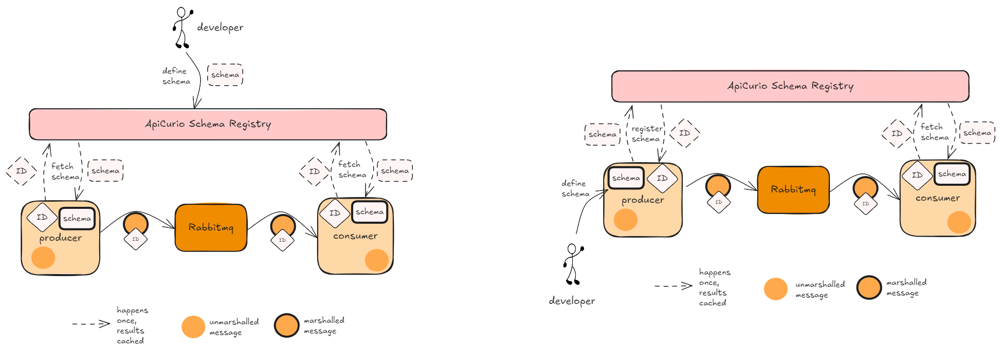

# Introduction 
This project demonstrates:
- **schema versioning** and **schema compatibility checks** with a schema registry (Apicurio)
- **schema registration** done during *development time* vs. during *run time*
- **schema validation** during serialisation/deserialisation
- **forward compatibility** with Avro
- how a **message broker/queue** (RabbitMQ) can work together with a **schema registry** (Apicurio)





Dependencies you need to run demo:
- `docker`
- `docker-compose`
- `make`

# Demo steps
### Step 1: Setup dependency services
- Run  `make init` top spin up rabbitmq and apicurio
- Makefile includes step to add v1 schema to schema registry (development time registration)
- (OPTIONAL) Manually configure validity and compatibility checks on [apicurio schema registry](http://localhost:8080/ui/artifacts)


### Step 2: Run my consumer v1
Run `make consumer1` 
- Consumer v1 gets the v1 schema from apicurio:
    ```
    {
        "type": "record",
        "name": "User",
        "fields": [
            {"name": "name", "type": "string"},
            {"name": "age", "type": ["int","null"], "default": 30}
        ]
    }
    ```
- Consumer subscribes to RabbitMQ


### Step 3: Run my producer v1
Run `make producer1` 
- Publisher v1 serialises message with v1 schema, publishes to RabbitMQ
- Consumer v1 consumes and deserialises message with v1 schema


### Step 4: Upgrade the schema and run new producer and consumer (runtime registration)
Run `make producer2` 
- Publisher v2 uploads new schema v2 to apicurio during runtime
    ```
    {
        "type": "record",
        "name": "User",
        "fields": [
            {"name": "name", "type": "string"},
            {"name": "age", "default": 0, "type": ["int","null"] },
            {"name": "email", "type": "string"}
        ]
    }
    ```
- Publisher v2 serialises message with v1 schema, publishes to RabbitMQ
- Consumer v1 consumes and *STILL MANAGES* to deserialise message with v1 schema due to **forward compatibility**.


### Step 5: Observe that consumer can react to new schema
Run `make consumer2` 
- Consumer v2 consumes and deserialises message with v2 schema


### Step 6: Clean up
Clean up by running `make rm` in each directory


### Extra information
- RabbitMQ GUI: http://localhost:15672
- Apicurio GUI: http://localhost:8080/ui/artifacts